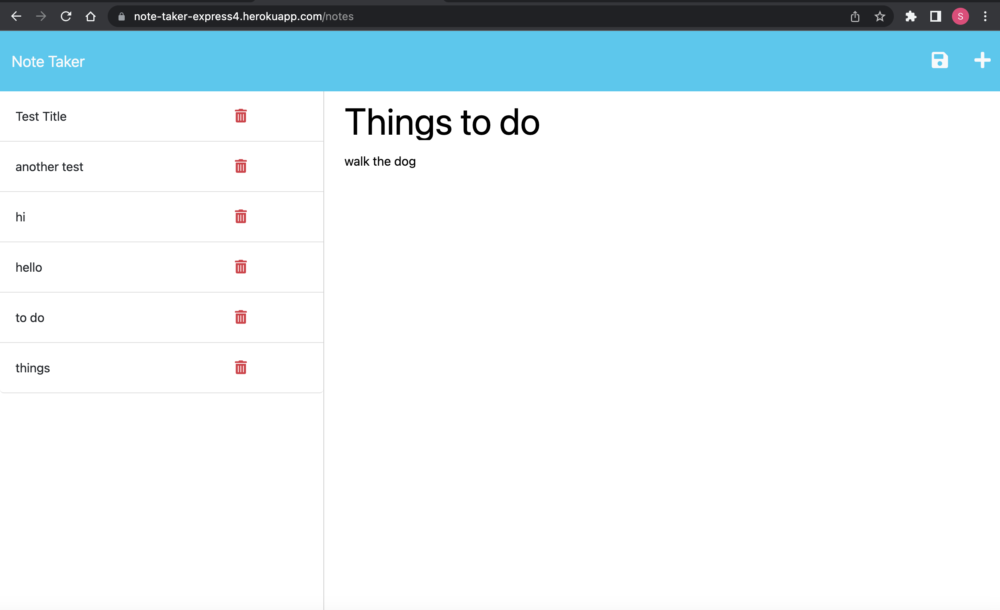

# **Note Taker**

## **Description**

This is a note taking application. Users can add and save to-do notes which they can refer back to when needed. 
## **Installation**

Run "npm i" in the terminal to install all the dependencies required. 

## **Usage**

To use this application, users simply add a note title and note text in the text boxes. To save a note, click the save icon on the top right of the page. You can reopen a note by simply clicking on the note title on the left side of the page.

>### To view the deployed site click [here](https://note-taker-express4.herokuapp.com/)